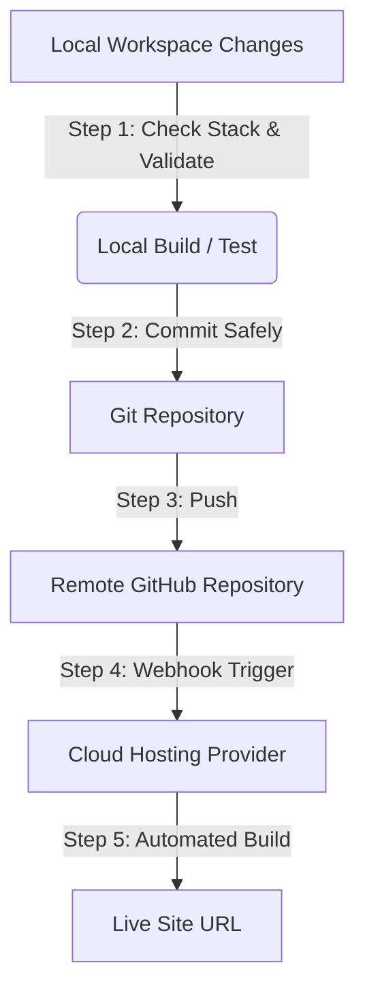

# Universal Hosting & Deployment Guide

This document defines the GitOps-based workflow for hosting and deploying web applications and services from any workspace. 

By pushing updates to a remote git repository (e.g., GitHub), connected cloud hosting platforms (such as **Vercel, Netlify, Cloudflare Pages, GitHub Pages, or Render**) automatically build and serve the application.

---

## 1. GitOps Architecture



---

## 2. Stack Detection Matrix
Before running build or verification commands, determine the environment of the current workspace:

| Stack / Indicator File | Package Manager | Validation Command | Production Build Command | Default Build Output |
| :--- | :--- | :--- | :--- | :--- |
| **Node.js** (`package.json`) | `npm`, `yarn`, `pnpm` | `npm run lint` / `test` | `npm run build` | `dist/`, `build/`, `.next/`, or `out/` |
| **Python** (`requirements.txt`, `pyproject.toml`) | `pip`, `poetry` | `pytest` / `flake8` | *Usually server-side run* | Dynamic or static assets |
| **Static HTML/JS** (no build config) | None (Vanilla) | Open `index.html` locally | N/A (Static files) | Workspace root folder |

---

## 3. Standard Deployment Protocol (SOP)

When executing a deployment or "uploading/updating stuff" to the live site, follow this universal process:

### Step 1: Detect Environment & Verify Locally
Do not push untested code. Verify it compiles and has no runtime/syntax errors.
1.  Check the workspace files to identify the runtime/framework.
2.  Install dependencies if required (e.g., `npm install` or `pip install -r requirements.txt`).
3.  Run the build command locally to verify compilation (e.g. `npm run build`).

### Step 2: Initialize Git (If Not Already Done)
If the project folder is not yet initialized as a Git repository:
1.  Initialize git:
    ```bash
    git init
    ```
2.  Link the workspace to the target remote repository:
    ```bash
    git remote add origin <remote-repository-url>
    ```

### Step 3: Check Ignore Rules & Stage Changes
Never publish intermediate files or private credentials.
1.  Verify that a `.gitignore` file exists and correctly contains:
    *   Secrets/config files (e.g., `.env`, `credentials.json`, `token.json`)
    *   Package folders (e.g., `node_modules/`, `.venv/`)
    *   Temporary directories (e.g., `.tmp/`, build cache files)
2.  Check what files are ready to stage:
    ```bash
    git status
    ```
3.  Stage the changes:
    ```bash
    git add .
    ```

### Step 4: Commit & Push to Remote
1.  Commit the changes with a clean, descriptive message:
    ```bash
    git commit -m "feat: implement updates and deploy changes"
    ```
2.  Determine the default remote branch (typically `main` or `master`):
    ```bash
    git branch -a
    ```
3.  Push the commit to trigger the cloud hosting provider's build pipeline:
    ```bash
    git push -u origin <branch-name>
    ```

### Step 5: Monitor Build & Notify
1.  Confirm to the user that changes have been pushed to GitHub.
2.  Explain that the hosting provider (e.g., Vercel, Netlify) will build the latest commit automatically.
3.  Provide the repository name and ask the user to verify the live URL.

---

## 4. Security & Best Practices

> [!IMPORTANT]
> **Strict Environment Isolation**: API keys, database credentials, and auth tokens must live strictly in `.env` (or the host's platform console settings) and never be committed to Git. Check `git diff --cached` before committing to verify no secrets are staged.

> [!WARNING]
> **Local Build Verification**: Skipping local verification is the leading cause of broken production sites. Always run the compilation script locally first.

---

## 5. Troubleshooting Common Issues

*   **Case-Sensitivity Mismatches**: Windows file systems are case-insensitive, but hosting builders (typically Linux-based) are case-sensitive. Importing `file.js` as `File.js` will work locally but fail on the build server. Always match casing exactly.
*   **Missing Hosting Variables**: If the app fails to fetch data or load on the live URL, check if the environment variables from `.env` are mirrored in the hosting provider's project settings dashboard.
*   **Git Authentication Failures**: If pushing fails with authentication errors, prompt the user to establish their Git credentials (SSH key or Personal Access Token). Do not enter passwords automatically.
